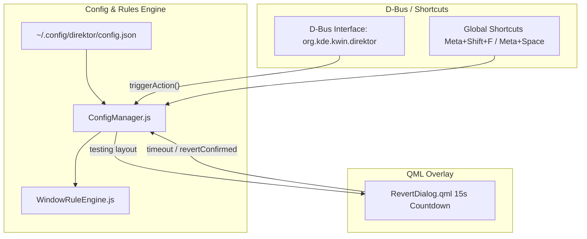

# Direktor Configuration, D-Bus Action Bridge & Safety Loop

This document details the JSON configuration parser, window rule engine, D-Bus IPC dispatcher, and QML safety revert dialog implemented in **Step 3** (`/src/config/`, `/src/ipc/`, and `/src/ui/`).

---

## Architecture Flow



---

## 1. JSON Configuration Format (`ConfigManager.js`)

Direktor stores its configuration in JSON structure:

```json
{
  "version": "1.0",
  "general": {
    "defaultLayout": "dwindle",
    "padding": 8,
    "revertTimeoutSeconds": 15
  },
  "monitors": {
    "DP-1": {
      "layout": "niri-scrollable"
    }
  },
  "rules": [
    {
      "match": { "resourceClass": "krunner" },
      "action": "ignore"
    },
    {
      "match": { "resourceClass": "org.kde.spectacle" },
      "action": "float"
    }
  ],
  "shortcuts": {
    "toggle_floating": "Meta+Shift+F",
    "cycle_layout": "Meta+Space",
    "promote_master": "Meta+Return"
  }
}
```

---

## 2. Window Rule Engine (`WindowRuleEngine.js`)

When `workspace.windowAdded` fires, `WindowRuleEngine.evaluateWindow(window)` inspects:
1. Standard window attributes (`!window.normalWindow`, `window.splash`, etc. -> `"ignore"`).
2. The user-defined JSON matching rules (`window.resourceClass`, `window.caption`, `window.dialog`).
3. Returns `"tile"`, `"float"`, or `"ignore"`.

---

## 3. D-Bus IPC Bridge (`DBusBridge.js`)

Enables external tools, custom hotkeys, or terminal scripts to invoke dynamic actions:

### Registered Actions
- **`toggle_floating`**: Toggles active window between `tile = target` and `tile = null`.
- **`cycle_layout`**: Switches the active monitor to the next layout in sequence.
- **`set_layout <layoutId>`**: Explicitly sets layout (`dwindle`, `niri-scrollable`, `master-stack`, `floating`).
- **`set_padding <px>`**: Updates gap padding dynamically.
- **`reload_config`**: Reloads configuration JSON from disk.

---

## 4. QML Keep/Revert Safety Dialog (`RevertDialog.qml`)

When a user applies a risky display or layout configuration, Direktor displays `RevertDialog.qml`:
- Starts a 15-second `Timer` countdown (`countdownTimer`).
- If the user clicks **"Keep Changes"**, the configuration is persisted.
- If the countdown reaches `0` or the user clicks **"Revert Now"**, Direktor rolls back to the previous layout state automatically.

---

## File Reference Table

| Module | Absolute File Path | Description |
| :--- | :--- | :--- |
| **Config Manager** | [`/src/config/ConfigManager.js`](file:///home/tcone/Documents/Scripts/Direktor/src/config/ConfigManager.js) | JSON config defaults, parser, validation |
| **Rule Engine** | [`/src/config/WindowRuleEngine.js`](file:///home/tcone/Documents/Scripts/Direktor/src/config/WindowRuleEngine.js) | Evaluates app windows (`tile`, `float`, `ignore`) |
| **D-Bus Bridge** | [`/src/ipc/DBusBridge.js`](file:///home/tcone/Documents/Scripts/Direktor/src/ipc/DBusBridge.js) | Action dispatcher for external IPC commands |
| **Revert Dialog** | [`/src/ui/RevertDialog.qml`](file:///home/tcone/Documents/Scripts/Direktor/src/ui/RevertDialog.qml) | 15-second countdown modal safety overlay |
