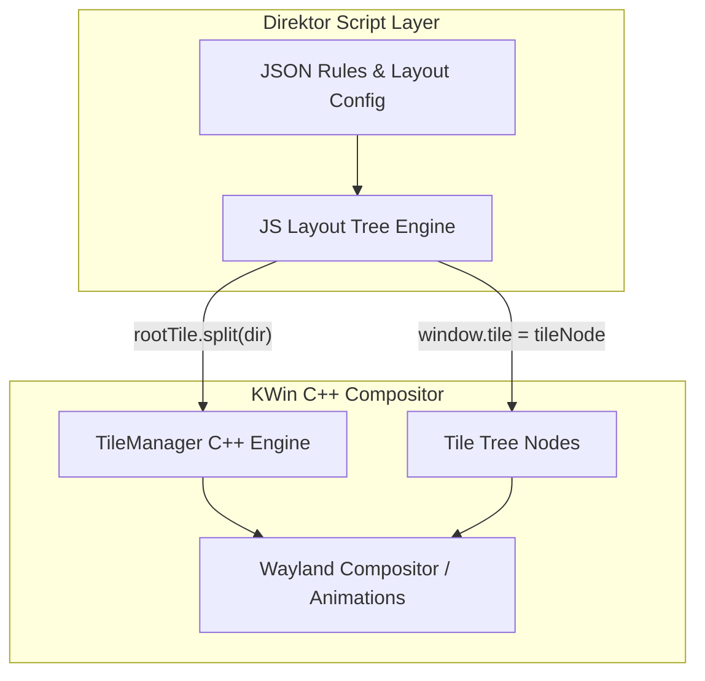
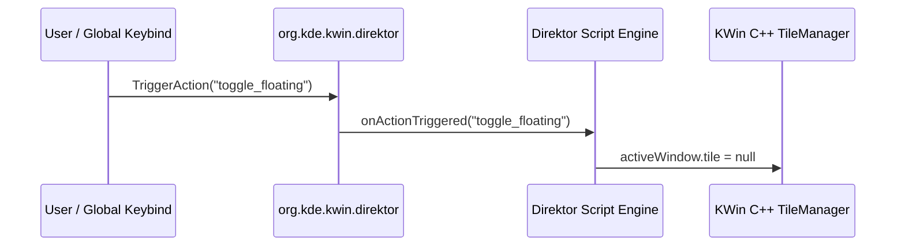

# KWin Documentation & Usages (Plasma 6 Tiling Architecture)

This document provides comprehensive engineering documentation, architectural usage patterns, and reference implementations for building **Direktor** — a Wayland-first, JSON-configured layout manager targeting the KDE Plasma 6 native C++ Tiling Engine (`KWin::TileManager`).

---

## Table of Contents

1. [Architectural Philosophy: Director vs. Animator](#1-architectural-philosophy-director-vs-animator)
2. [Wayland vs. X11 Separation](#2-wayland-vs-x11-separation)
3. [The Core KWin Plasma 6 Scripting API](#3-the-core-kwin-plasma-6-scripting-api)
    - [The `workspace` Global State](#the-workspace-global-state)
    - [The `window` Application Client](#the-window-application-client)
    - [The `TileManager` and `Tile` Objects](#the-tilemanager-and-tile-objects)
4. [The D-Bus Action Bridge](#4-the-d-bus-action-bridge)
5. [The Keep/Revert Safety Timeout Loop (QML + JS)](#5-the-keeprevert-safety-timeout-loop-qml--js)
6. [Step-by-Step Layout Implementation Recipes](#6-step-by-step-layout-implementation-recipes)
7. [Reference Files in `/Documentation/Sources/`](#7-reference-files-in-documentationsources)

---

## 1. Architectural Philosophy: Director vs. Animator



### Why Older Plasma 5 Scripts Break in Plasma 6
In Plasma 5 X11 scripts (such as Bismuth), scripts directly calculated window coordinates and forced window geometry:
```javascript
// ANTI-PATTERN (Plasma 5 / X11 Legacy)
window.geometry = {
    x: monitorX + 10,
    y: monitorY + 10,
    width: 950,
    height: 1040
};
```
**Why this fails in Plasma 6:**
- Directly mutating geometry fights KWin's internal Wayland compositor rendering pipeline.
- It breaks native window animations, causing stuttering and visual snapping.
- Wayland clients do not operate in a global coordinate space.

### The Plasma 6 Solution
In Plasma 6, KWin introduces a native C++ `TileManager` tree per output monitor.
- **Your Script (Direktor)** acts as the **Director**: It parses user layout preferences and builds a logical tree of `Tile` nodes.
- **KWin** acts as the **Animator**: You assign `window.tile = tileNode`, and KWin's C++ compositor calculates scaling, gaps (`padding`), and multi-monitor coordinates while animating transitions smoothly.

---

## 2. Wayland vs. X11 Separation

| Concept | X11 Legacy Model | Wayland / Plasma 6 Model |
| :--- | :--- | :--- |
| **Coordinate Space** | Absolute global pixel grid across all monitors | Screen-relative logical `Tile` hierarchy |
| **Window Resizing** | Script forces absolute width/height in px | Script splits `Tile` containers (`relativeGeometry`) |
| **Tiling Trigger** | `client.frameGeometry = rect` | `window.tile = targetTile` |
| **Floating State** | Script tracks custom boolean flags | `window.tile = null` |

> [!IMPORTANT]
> **Rule of Thumb:** Never read or write `window.geometry` for layout positioning. Always manipulate `Tile` nodes and assign windows to tiles.

---

## 3. The Core KWin Plasma 6 Scripting API

### The `workspace` Global State
The `workspace` singleton manages monitors, active windows, and global signals:

```javascript
// 1. Intercept newly added windows
workspace.windowAdded.connect((window) => {
    // Process window tiling
});

// 2. Handle window removal
workspace.windowRemoved.connect((window) => {
    // Rebalance tiles when a window closes
});

// 3. Obtain the native TileManager for a monitor
const output = workspace.screens[0];
const tileManager = workspace.tilingForScreen(output);
```

### The `window` Application Client
Every application window is exposed as a `Window` object:

- **`window.tile` (The Golden Property):**
  ```javascript
  // Tile a window
  window.tile = rootTile.childTiles[0];

  // Float a window
  window.tile = null;
  ```
- **Filtering Popups & Dialogs:**
  ```javascript
  function shouldTile(window) {
      if (!window.normalWindow || window.dialog || window.splash || window.utility) {
          return false;
      }
      return true;
  }
  ```

### The `TileManager` and `Tile` Objects
Each physical `Output` has a `TileManager` containing a `rootTile`:

```javascript
const tileManager = workspace.tilingForScreen(window.output);
const rootTile = tileManager.rootTile;

// Split root tile horizontally into left/right halves
// Direction: 0 = Horizontal, 1 = Vertical
rootTile.split(0);

// Adjust gap padding
rootTile.padding = 8;
```

---

## 4. The D-Bus Action Bridge

KWin scripts run in an isolated sandbox. While `workspace.registerShortcut` allows triggering internal script functions, executing dynamic shell commands or exposing external IPC requires a **D-Bus interface**.



### Registering Shortcuts in JS
```javascript
workspace.registerShortcut(
    "direktor_toggle_floating",
    "Direktor: Toggle Floating",
    "Meta+Shift+F",
    () => {
        const active = workspace.activeWindow;
        if (!active) return;
        active.tile = (active.tile === null) ? getDefaultTile(active.output) : null;
    }
);
```

---

## 5. The Keep/Revert Safety Timeout Loop (QML + JS)

When applying structural JSON layout or monitor configuration changes, standard browser blocking modals (`confirm()` / `alert()`) are strictly forbidden in KWin.

To implement a 15-second safety revert mechanism, use a **QML Dialog Overlay** with an embedded `Timer`:

```qml
// RevertDialog.qml
import QtQuick
import QtQuick.Controls

Dialog {
    id: revertDialog
    title: "Confirm Layout Configuration"
    modal: true

    property int countdown: 15
    signal keepClicked()
    signal revertClicked()

    Timer {
        interval: 1000
        repeat: true
        running: true
        onTriggered: {
            countdown -= 1
            if (countdown <= 0) {
                revertDialog.revertClicked()
                revertDialog.close()
            }
        }
    }

    footer: DialogButtonBox {
        Button {
            text: "Keep (" + countdown + "s)"
            onClicked: {
                revertDialog.keepClicked()
                revertDialog.close()
            }
        }
        Button {
            text: "Revert Now"
            onClicked: {
                revertDialog.revertClicked()
                revertDialog.close()
            }
        }
    }
}
```

---

## 6. Step-by-Step Layout Implementation Recipes

### Master / Stack Layout Recipe
1. Inspect `rootTile` for the active output.
2. Ensure `rootTile` is split horizontally (`direction = 0`).
3. Assign the first window (Master) to `rootTile.childTiles[0]`.
4. If more than 2 windows exist, split `rootTile.childTiles[1]` vertically (`direction = 1`) to stack remaining windows.

---

## 7. Reference Files in `/Documentation/Sources/`

We have organized the core source references in `/Documentation/Sources`:
- **[`KWin_Plasma6_C++_TileManager_Headers.hpp`](file:///home/tcone/Documents/Scripts/Direktor/Documentation/Sources/KWin_Plasma6_C++_TileManager_Headers.hpp)**: C++ header reference for `TileManager` and `Tile` from KWin `src/plugins/tiles/`.
- **[`KWin_Plasma6_Scripting_API.d.ts`](file:///home/tcone/Documents/Scripts/Direktor/Documentation/Sources/KWin_Plasma6_Scripting_API.d.ts)**: Comprehensive TypeScript/JS declarations for KWin Plasma 6 scripting.
- **[`Minimal_Direktor_Hello_World.js`](file:///home/tcone/Documents/Scripts/Direktor/Documentation/Sources/Minimal_Direktor_Hello_World.js)**: Executable reference Plasma 6 script demonstrating Wayland-safe tiling hooks.
- **[`Minimal_Direktor_Metadata.json`](file:///home/tcone/Documents/Scripts/Direktor/Documentation/Sources/Minimal_Direktor_Metadata.json)**: Standard Plasma 6 metadata manifest.
