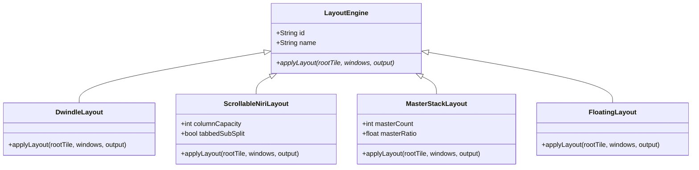

# Direktor Layouts & Wayland Tile Engine Architecture

This document details the core mathematical models and Plasma 6 Wayland tile tree algorithms implemented in `/src/layouts/` and `/src/core/TileUtils.js`.

---

## Overview of Core Layouts



---

## 1. Dwindle Layout (Hyprland-style)
- **Identifier:** `dwindle`
- **Class:** `DwindleLayout`
- **Algorithm:**
  - Builds a recursive binary tree where each new window splits the most recently focused/created leaf tile along its longest edge (`TileUtils.getLongestEdgeDirection`).
  - Produces a natural dwindling spiral where area halves at each recursion depth:
    ```
    +-------------------+-------------------+
    |                   |         2         |
    |                   +---------+---------+
    |         1         |    3    |    4    |
    |                   |         |         |
    +-------------------+---------+---------+
    ```

---

## 2. Scrollable Column & Horizontal Tabs Layout (Niri-style)
- **Identifier:** `niri-scrollable`
- **Class:** `ScrollableNiriLayout`
- **Algorithm:**
  - Organizes windows into top-level horizontal **Columns** across the viewport (`rootTile.split(DIRECTION_HORIZONTAL)`).
  - When a column holds multiple windows (exceeding single capacity up to `defaultColumnCapacity`), the column tile sub-splits:
    - **Tabbed Mode (`tabbedSubSplit = true`):** Sub-splits horizontally to group windows side-by-side as tabs/slots inside the column.
    - **Stacked Mode (`tabbedSubSplit = false`):** Sub-splits vertically to stack windows inside the column.

---

## 3. Master & Stack Layout (DWM / Krohnkite style)
- **Identifier:** `master-stack`
- **Class:** `MasterStackLayout`
- **Algorithm:**
  - Top-level split divides the monitor horizontally into **Master Column** (Left, e.g., 55% ratio) and **Stack Column** (Right, e.g., 45% ratio).
  - Multiple windows allocated to Master or Stack are sub-split vertically (`DIRECTION_VERTICAL`).

---

## 4. All Floating Layout
- **Identifier:** `floating`
- **Class:** `FloatingLayout`
- **Algorithm:**
  - Iterates through all normal windows on the active screen and sets `window.tile = null`.
  - Disables KWin tiling constraints, allowing standard unconstrained mouse drag and resize operations.

---

## File Reference Table

| Module | Absolute File Path | Description |
| :--- | :--- | :--- |
| **Tile Utilities** | [`/src/core/TileUtils.js`](file:///home/tcone/Documents/Scripts/Direktor/src/core/TileUtils.js) | C++ `Tile` tree wrappers (`splitTile`, `getLeafTiles`, `assignWindowToTile`) |
| **Base Interface** | [`/src/layouts/LayoutEngine.js`](file:///home/tcone/Documents/Scripts/Direktor/src/layouts/LayoutEngine.js) | Abstract base layout engine contract |
| **Dwindle Layout** | [`/src/layouts/DwindleLayout.js`](file:///home/tcone/Documents/Scripts/Direktor/src/layouts/DwindleLayout.js) | Hyprland-style recursive binary Dwindle layout |
| **Niri Scrollable** | [`/src/layouts/ScrollableNiriLayout.js`](file:///home/tcone/Documents/Scripts/Direktor/src/layouts/ScrollableNiriLayout.js) | Niri-style horizontal columns with tab/stack sub-splits |
| **Master-Stack** | [`/src/layouts/MasterStackLayout.js`](file:///home/tcone/Documents/Scripts/Direktor/src/layouts/MasterStackLayout.js) | DWM-style Master and vertical Stack columns |
| **All Floating** | [`/src/layouts/FloatingLayout.js`](file:///home/tcone/Documents/Scripts/Direktor/src/layouts/FloatingLayout.js) | Sets `window.tile = null` across workspace |
| **Layout Manager** | [`/src/layouts/LayoutManager.js`](file:///home/tcone/Documents/Scripts/Direktor/src/layouts/LayoutManager.js) | Manages layouts, cycling, and applying to screens |
